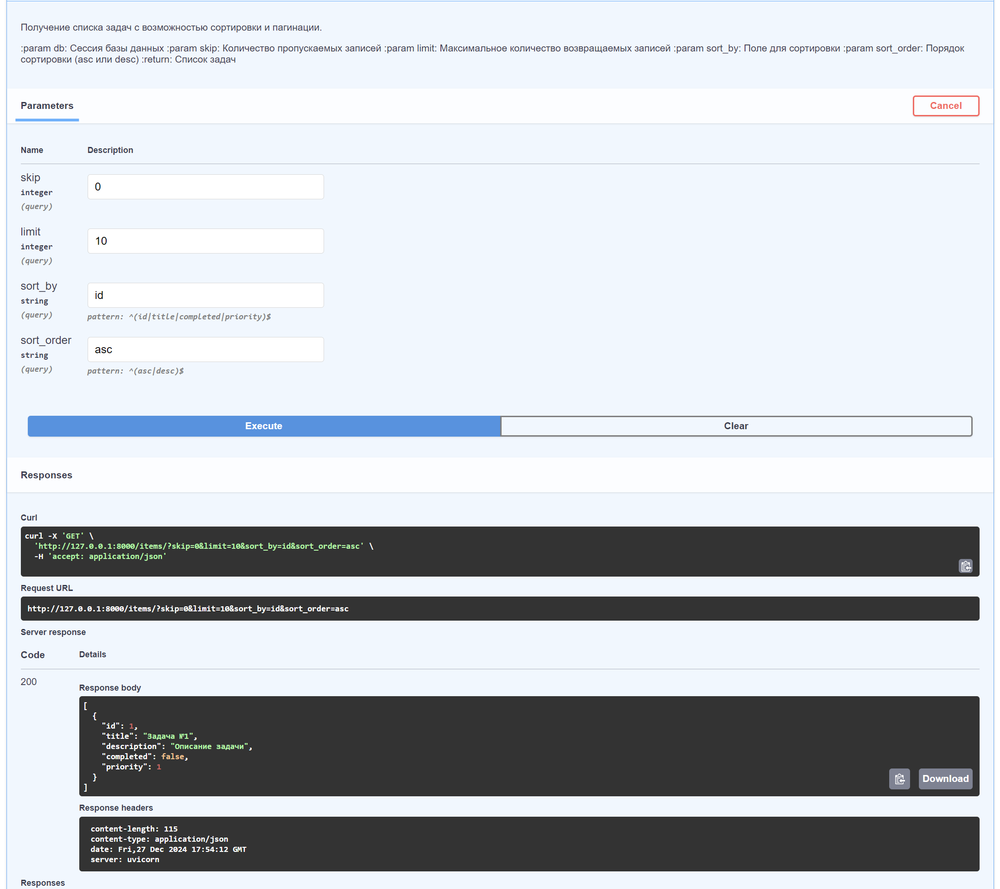

# TODO API с FastAPI и SQLite

Этот проект представляет собой простой `TODO-сервис`, который использует `FastAPI` для создания `RESTful API`, `SQLite` для хранения данных и `Docker` для контейнеризации приложения.

## 📁 Структура проекта

```textfile
todo_project/
│
├── main.py                # Основной файл с кодом FastAPI
├── requirements.txt       # Список зависимостей
├── Dockerfile             # Конфигурация для Docker
├── .gitignore             # Файлы и папки, которые будут игнорироваться Git
└── test.db                # База данных SQLite (создается автоматически)
```

## ⚙️ Установка

1. **Клонируйте репозиторий**

```bash
git clone https://github.com/username/todo_project.git
cd todo_project
```

2. **Установите зависимости**

**Создайте виртуальное окружение (необязательно, но рекомендуется):**

```bash
python -m venv venv
source venv/bin/activate  # Для macOS/Linux
venv\Scripts\activate     # Для Windows
```

Затем установите зависимости из файла `requirements.txt`:

```bash
pip install -r requirements.txt
```

3. **Запуск приложения**

**Для запуска приложения используйте **Uvicorn**:**

```bash
uvicorn main:app --reload
```

Приложение будет доступно по адресу [http://127.0.0.1:8000](http://127.0.0.1:8000).

4. **Запуск через Docker**

**Если вы хотите запустить приложение в контейнере Docker, выполните следующие шаги:**

1. **Построить Docker-образ:**

```bash
docker build -t todo_project .
```

2. **Запустить контейнер:**

```bash
docker run -d -p 8000:8000 todo_project
```

Теперь приложение будет доступно по адресу [http://127.0.0.1:8000](http://127.0.0.1:8000).

## 🔧 Эндпоинты API

1. **POST /items** — Создание задачи

   **Пример запроса:**
   ```json
   {
   "title": "New Task",
   "description": "This is a new task",
   "completed": false
   }
   ```
2. **GET /items** — Получение списка всех задач
3. **GET /items/{item_id}** — Получение задачи по ID
4. **PUT /items/{item_id}** — Обновление задачи по ID

   **Пример запроса:**
   ```json
   {
   "title": "Updated Task",
   "description": "This task has been updated",
   "completed": true
   }
   ```
5. **DELETE /items/{item_id}** — Удаление задачи по ID

## Тестирование

Вы можете тестировать API с помощью **Postman** или **curl**

**Пример запроса для создания задачи:**

```bash
curl -X 'POST' \
  'http://127.0.0.1:8000/items/' \
  -H 'Content-Type: application/json' \
  -d '{
  "title": "New Task",
  "description": "This is a new task"
}'
```

## Разработка

- Для тестирования и разработки используйте **Postman** или **curl**.
- При необходимости можете настроить сервер для работы с другими базами данных или хостингами.




## 📜 Лицензия

Этот проект распространяется под лицензией MIT.

См. файл [LICENSE](LICENSE) для подробной информации.
